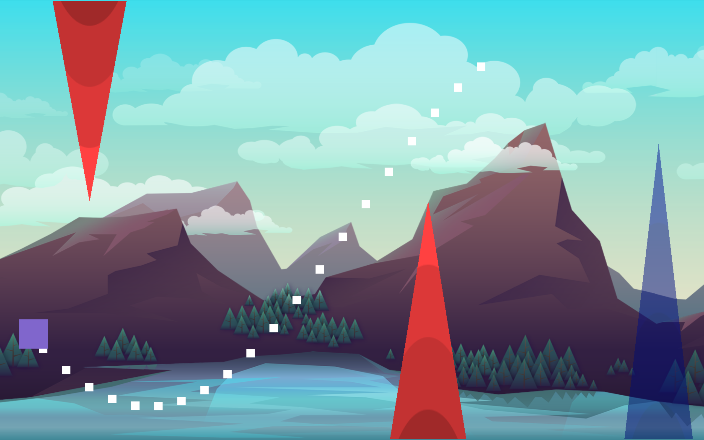

# Dasher

**Screenshots**  
  
  
  
  
  
  
  
**About**  
Phasor is a cross platform game built entirely using OpenGL and C++. Currently supported and tested platforms are MacOS and Windows. The player controls the speed of oscillation of the square block using the mouse cursor and has to avoid all the spikes that are coming towards them.
  
**Installation Details**  
Built executables can directly be downloaded and played without any installation. You can download the latest release .zip file for your platform.  
Alternatively, you could build the code yourself. All the necessary dependencies are located in the repositroy with the only exception being CMake. To build the repo run the following commands from the root directory:  
```
mkdir build
cmake ..
```

On Windows, this would create a Visual Studio .sln file. Open the .sln file and build the project.  
On MacOS, this would create a MakeFile. Run `make` in the build directory to build the game  
  
